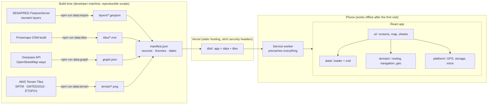
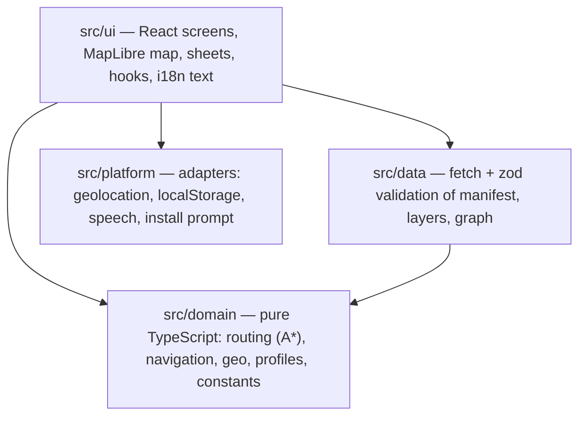

# Architecture

Evacua is a **fully static, offline-first web app (PWA)**. There is no backend, no database and
no external API at runtime: every byte the app needs (code, official layers, map tiles, relief,
walking network, fonts) is generated at build time, committed to the repository, served from
the same origin and stored by a service worker on the first visit. After that, the phone can
be in airplane mode.

## Overview

`npm run build` validates all data with the same loader the browser uses (`data:validate`)
before bundling, so a broken or unlabeled data file fails the build.

## Layers in the code

| Folder          | What lives there                                                                                                                                                                                                | Rules                                                                                                                    |
| --------------- | --------------------------------------------------------------------------------------------------------------------------------------------------------------------------------------------------------------- | ------------------------------------------------------------------------------------------------------------------------ |
| `src/domain/`   | Evacuation planning (`routing.ts`), turn-by-turn and "how to get there" (`navigation.ts`), geometry (`geo.ts`), walking graph (`graph.ts`), profiles as typed config, **all safety constants** (`constants.ts`) | Pure functions, no browser APIs, no React. ESLint forbids importing UI, platform or i18n. ≥ 95 % coverage enforced in CI |
| `src/data/`     | `loader.ts` fetches and validates every file; `schema.ts` holds the zod schemas (every feature must carry `source`, `sourceUrl`, `retrievedAt`, `license`, `verified`)                                          | Any invalid file fails the whole commune with an explicit error screen                                                   |
| `src/platform/` | Small adapters around browser APIs that return result types instead of throwing                                                                                                                                 | Storage access is wrapped in try/catch; the app works with defaults when storage is blocked                              |
| `src/ui/`       | Screens, the MapLibre map (`map/`), the route sheet, dialogs, tutorial, hooks                                                                                                                                   | No UI text in code: everything goes through the `es-CL` / `en` dictionaries (identical keys)                             |

## Data model: adding a commune is adding data

`public/data/communes/index.json` lists the communes; each one has a `manifest.json` with its
service area, bounds, layers (role + file + source id), sources (publisher, URL, license, date),
basemap tiles, relief tiles, walking graph and DEMO locations. The code reads all of it from the
manifest; nothing about Coronel is hard-coded. See [DATA_SOURCES.md](DATA_SOURCES.md) for every
dataset, its license and how to regenerate it.

## How a route is planned

1. **Where am I?** GPS (one reading, or continuous while navigating), a tap on the map, or a
   labeled DEMO point. The position lives only in memory.
2. **Am I in danger?** Point-in-polygon against SENAPRED's tsunami evacuation area.
3. **Shortest way out, then to a meeting point** (`planEvacuation`): A\* over the OpenStreetMap
   walking network, first out of the evacuation area by the shortest path, then on to the
   nearest official meeting point without walking back into the area — following SENAPRED's
   "prioriza la evacuación horizontal hacia un Punto de Encuentro y/o Área de Seguridad".
4. **No data basis, no route:** outside the pilot area the app says so; if the network cannot be
   used it shows only a labeled straight line (distance and direction), never a drawn route.
5. **Time** uses walking speeds cited from FEMA P-646 (normal and mobility-impaired paces),
   shown per profile.
6. **Navigation** recomputes the plan from every new position (so leaving the route simply
   re-plans), announces the next turn with its street, and confirms the arrival. A DEMO walk
   replays the route at a labeled 10× speed for judges who are not in Coronel.

The routing context (graph + "safe node" index) is prepared in a quiet moment after the app opens,
so neither the first paint nor the first "find my route" waits for it.

## Offline and updates

- `vite-plugin-pwa` (Workbox, `generateSW`) precaches the app shell, data, map tiles, relief
  tiles and label glyphs (≈ 230 files). `clientsClaim` lets the very first visit work offline.
- A new version is downloaded in the background; the user sees a "new version" prompt and
  chooses when to reload.
- The status icon in the top bar shows "preparing", "works offline" or "no connection".

## Map

MapLibre GL JS renders offline vector tiles (OSM via Protomaps), the official layers (hatched
evacuation area, safe line, dashed official routes, meeting point markers), the user's route
(blue line with direction chevrons) and the destination label. Its worker is bundled from the
same origin, so the CSP needs no `blob:` workers. The optional 3D view drapes the map over
offline elevation tiles (relief drawn ×3, labeled "aproximado"); elevation is display only and
never used for safety decisions.

## Security and privacy by design

- Strict CSP (`script-src 'self'`, `connect-src 'self'`, no `unsafe-inline` / `unsafe-eval`),
  HSTS, `X-Frame-Options: DENY`, `nosniff`, `Referrer-Policy: no-referrer`, a narrow
  `Permissions-Policy`. One source of truth: `vercel.json`; `vite preview` and the e2e tests use
  the same headers. See [SECURITY.md](SECURITY.md).
- No accounts, analytics or telemetry; the location is never stored or sent. See
  [PRIVACY.md](PRIVACY.md).

## Quality gates (CI on every push)

`format:check` → `lint` (0 warnings) → `typecheck` (strict) → unit tests with coverage
thresholds → `build` (includes data validation) → `npm audit --audit-level=high` → Playwright
end-to-end tests against `vite preview` with the real headers, including offline, installability,
CSP-violation and axe accessibility checks.
