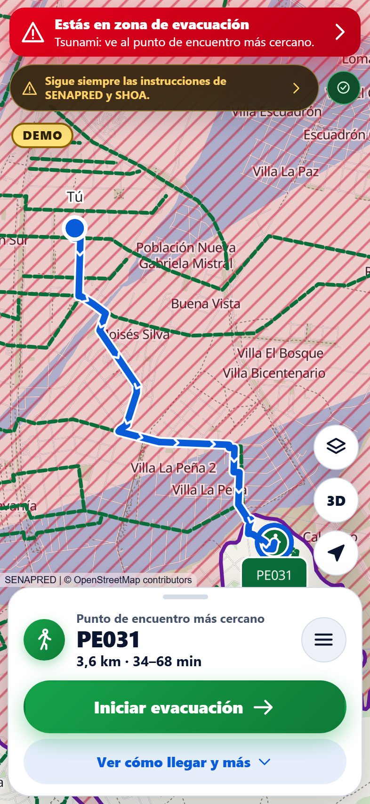
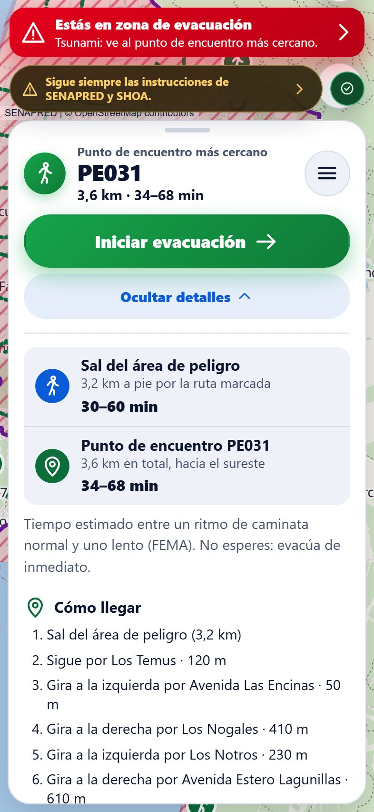
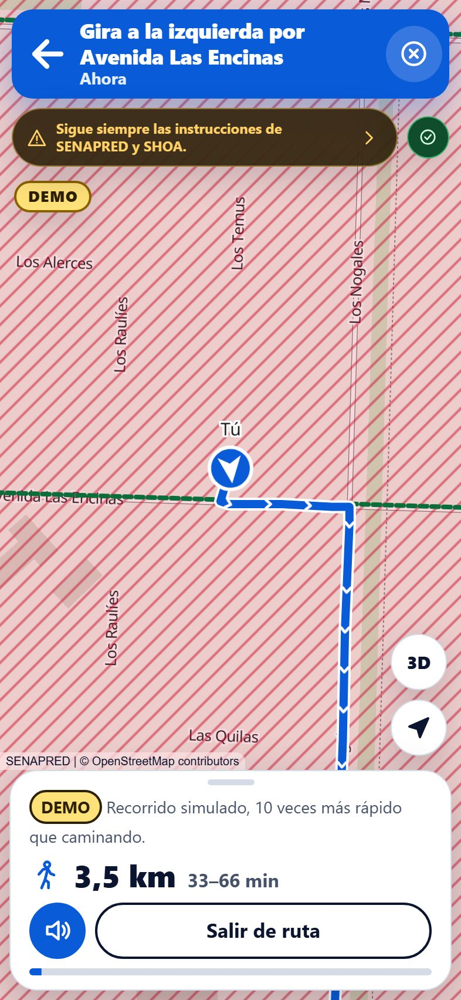
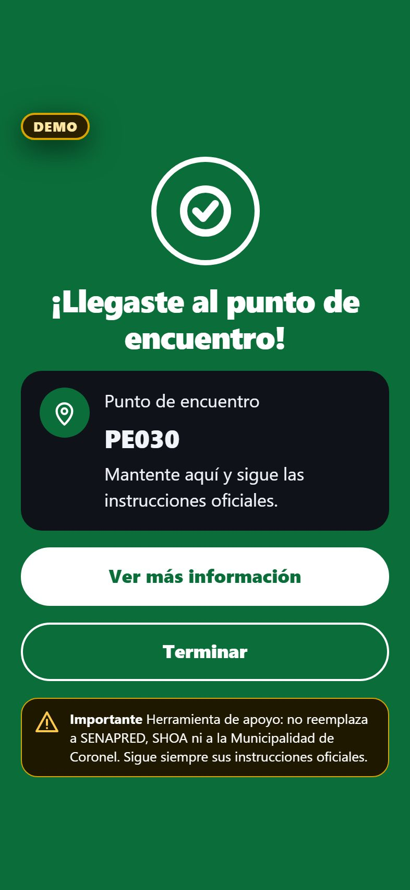
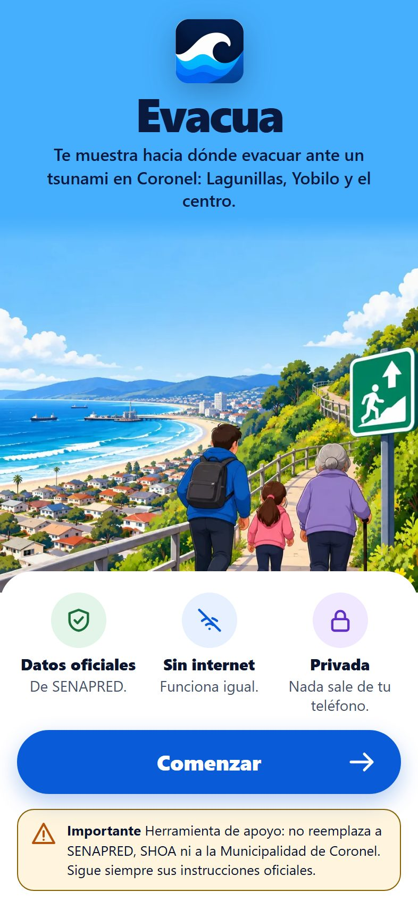
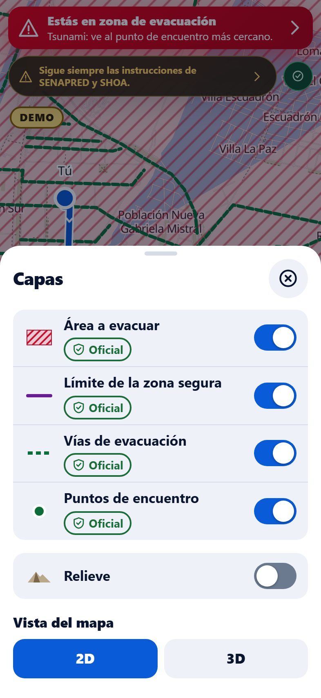
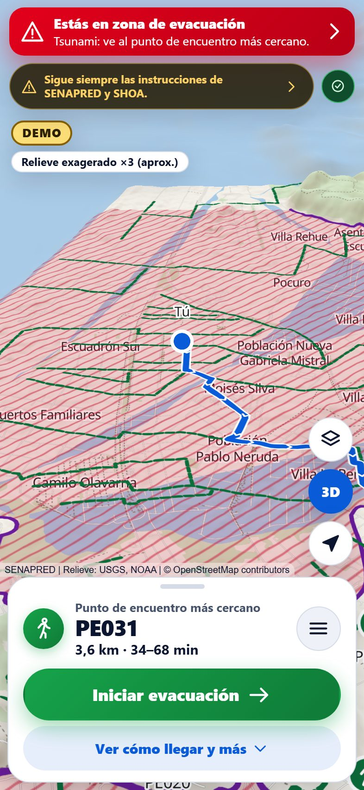
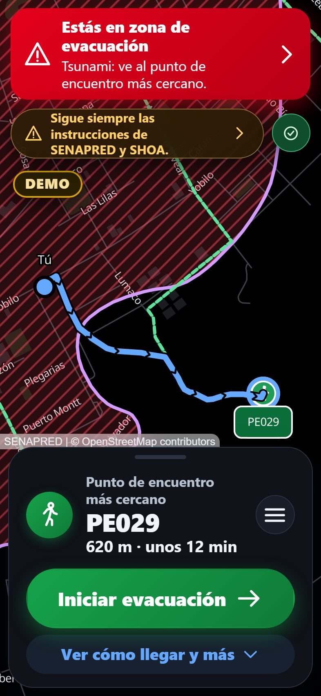
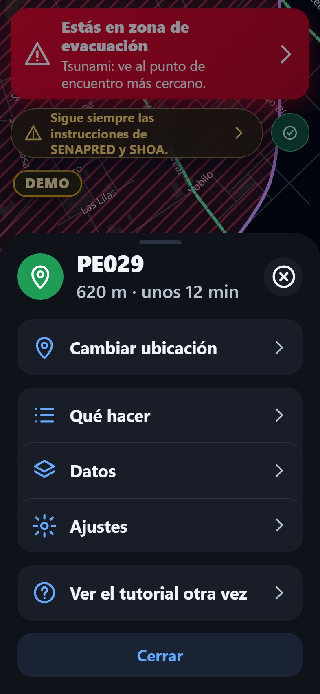

# Evacua

[](https://github.com/carlostoledo-dev/Evacua/actions/workflows/ci.yml)
[](https://evacua-phi.vercel.app)
[](LICENSE)

**An offline tsunami evacuation map for Coronel, Chile.** Install it from the browser, and when
the ground shakes it tells you, with no internet, whether you are in the official evacuation
area, where to go (the nearest official meeting point) and the shortest walking way there,
street by street and out loud.

> **Support tool only.** It does not replace the authorities (SENAPRED, SHOA, Municipalidad de
> Coronel). Always follow their official instructions.

**Live demo:** https://evacua-phi.vercel.app · Built for **WarriorHacks 2.0** ·
[Resumen en español](#resumen-en-español)

<p>
  
  
  
  
</p>

## The problem

Coronel sits on Chile's Biobío coast, in one of the most earthquake-prone regions on Earth
(the 2010 Maule earthquake and tsunami hit this coast). SENAPRED, Chile's disaster agency, has
mapped the tsunami evacuation area, routes and meeting points — but that knowledge lives on
web maps and printed signs. After a strong earthquake, mobile networks often fail or saturate
exactly when people need to know where to go, and visitors, children and older adults may not
know the way.

## Who it is for

People in the pilot area — **Lagunillas, Yobilo and Coronel Centro** — including people who are
not used to maps: three profiles change the app without making separate apps.

| Profile          | What changes                                                                                                |
| ---------------- | ----------------------------------------------------------------------------------------------------------- |
| **Persona**      | Full map with layers, 3D relief and turn-by-turn navigation                                                 |
| **Adulto mayor** | Very large text, one big button, no map buttons, instructions read aloud automatically, time at a slow pace |
| **Niño/a**       | Short phrases, icons, no times, livelier colors and "Busca a tu adulto o profesor y sigue el plan"          |

## What it does

- **Works with no internet.** Installable PWA; the map, the official data and the walking
  network (≈ 6 MB) are cached on the phone. Tested in airplane mode by an end-to-end test.
- **Official data only.** SENAPRED's tsunami evacuation area, routes and meeting points
  (2024). Each layer shows its source and an "official" or "DEMO" badge; nothing is invented.
- **Where to go and how.** Using GPS (or a labeled DEMO point), it says whether you are in the
  evacuation area and plans, on the phone, the shortest walk out of it and then to the nearest
  official meeting point **without walking back into the danger area**.
- **Turn-by-turn navigation** with street names, read aloud with the phone's own voices, and
  an arrival screen. The demo walk is simulated 10× faster and labeled DEMO.
- **Time as a range** (FEMA P-646 average and mobility-impaired walking speeds), never as a
  promise. Outside the data area it says so; without a street network it shows only a straight
  line, labeled "not a route".
- **SENAPRED's own guidance** (what to do in a tsunami, the emergency backpack checklist).
- **3D relief** of Coronel's hills (display only, labeled "height exaggerated ×3").
- **Spanish (Chile) and English**, light and dark themes, a short tutorial.
- **Private by design:** no accounts, no analytics, the location never leaves the phone
  ([PRIVACY.md](PRIVACY.md)).

<p>
  
  
  
  
  
</p>

## Try it

1. Open https://evacua-phi.vercel.app on a phone (or desktop Chrome) and add it to the home
   screen (Share → Add to Home Screen on iPhone; Install in Chrome).
2. Choose a profile. Open it once online so everything is cached; then turn on airplane mode.
3. We are not in Coronel? Tap **"Probar DEMO"** and pick a test point (always labeled DEMO).

The video script is in [docs/DEMO_SCRIPT.md](docs/DEMO_SCRIPT.md).

## Run it locally

Requires Node.js 24+ (see `.nvmrc`).

```bash
npm install
npx playwright install chromium   # once, for the end-to-end tests
npm run dev                       # http://localhost:5173 (no service worker, no CSP)
```

```bash
npm run check      # format, lint (0 warnings), typecheck, unit tests, build (validates all data)
npm run test:e2e   # Playwright on the production build with the real security headers, incl. offline
npm run test:coverage
```

`npm run build && npm run preview` serves the production build with the same security headers
as production (http://localhost:4173).

### Regenerate the data

Generated data is committed; CI never downloads anything. To rebuild it from the sources:

```bash
npm run data:import    # SENAPRED tsunami layers for the commune's bounds
npm run data:tiles     # offline OpenStreetMap vector tiles (Protomaps build)
npm run data:graph     # walking network from OpenStreetMap (Overpass API)
npm run data:terrain   # elevation tiles for the 3D relief
npm run data:glyphs    # label font glyphs
npm run data:validate  # validate everything with the same zod schemas the app uses
```

Each script records its source, license and date in the commune's manifest. Details:
[DATA_SOURCES.md](DATA_SOURCES.md). Screenshots: `node scripts/screenshots.ts` against
`npm run preview`.

## How it is built

Vite + React + TypeScript (strict), MapLibre GL JS with offline vector tiles, zod, Workbox
(vite-plugin-pwa), Vitest and Playwright, static hosting on Vercel. Fully static: no backend,
no runtime APIs, no third-party requests. Routing is A\* over an OpenStreetMap walking graph,
run on the phone.

- [ARCHITECTURE.md](ARCHITECTURE.md) — layers, data flow, routing, offline, diagrams
- [DATA_SOURCES.md](DATA_SOURCES.md) — every dataset, its license and how to update it
- [SECURITY.md](SECURITY.md) — strict CSP, headers, validation, reporting
- [PRIVACY.md](PRIVACY.md) — what is (not) collected
- [CONTRIBUTING.md](CONTRIBUTING.md) — ground rules, adding a commune

**Quality checks (2026-10-07):** Lighthouse mobile Accessibility 100, Best Practices 100,
SEO 100; installability verified by an e2e test; all 8 security headers checked on production;
`src/domain` coverage 99 % statements / 100 % lines; `npm audit`: 0 vulnerabilities.

## Limits (read before relying on it)

- **One pilot area.** Only Lagunillas, Yobilo and Coronel Centro. Elsewhere it says you are
  outside the area and draws no route.
- **Data is as good as its sources.** SENAPRED 2024 layers and OpenStreetMap streets. A street
  may be blocked after an earthquake; the app cannot know. SENAPRED has not yet confirmed reuse
  terms in writing (it is cited as IDE Chile asks).
- **Times are estimates** from published walking speeds, not a guarantee that you have time.
- **GPS can be wrong** indoors or near tall buildings.
- **Tsunami only.** Earthquake and wildfire need their own official data before they come back.
- **Voice** needs an on-device voice for the language; otherwise the text stays on screen.
- Not tested with the community or the authorities yet.

## Roadmap

- Validate with SENAPRED, the Municipalidad de Coronel and residents; written data-reuse terms.
- The rest of Coronel and the other 12 coastal communes of Biobío as per-commune downloads
  (official SENAPRED data exists for all of them; adding a commune is adding data, not code).
- Vertical evacuation buildings and accessible routes, once official data exists.
- Earthquake and wildfire guidance with their own official layers.

## Pre-existing work

None. All of Evacua's code, documentation and data pipeline were created during WarriorHacks 2.0
(work started 2026-10-01). It uses third-party libraries and datasets, listed below with their
licenses; no third-party code was copied into the repository.

## AI use

Built by one person (the project owner) with **Claude Code** (Anthropic) as a coding assistant.
The owner set the goals, made every product and safety decision and tested on real phones; the
AI wrote most of the code, tests and documentation under the rules in [CLAUDE.md](CLAUDE.md).
Some images (welcome hero, app icon, profile avatars) were generated by the owner with ChatGPT
Images. No geographic or safety data was generated by AI. Full log:
[AI_DISCLOSURE.md](AI_DISCLOSURE.md).

## Credits and licenses

| What                                            | Source                                                                                                        | License                                             |
| ----------------------------------------------- | ------------------------------------------------------------------------------------------------------------- | --------------------------------------------------- |
| Tsunami evacuation area, routes, meeting points | SENAPRED, "Amenaza por Tsunami" 2024 (IDE Chile)                                                              | No license declared; source cited as IDE Chile asks |
| Safety guidance and backpack checklist          | senapred.cl                                                                                                   | Quoted with attribution                             |
| Streets, map tiles, walking network             | © OpenStreetMap contributors, via Protomaps                                                                   | ODbL 1.0                                            |
| Elevation (3D relief)                           | Terrain Tiles (AWS Open Data): SRTM and GMTED2010 courtesy of the U.S. Geological Survey; ETOPO1 by NOAA NCEI | Public domain, credit requested                     |
| Walking speeds                                  | FEMA P-646 (2019)                                                                                             | U.S. Government work                                |
| Label font: Noto Sans (glyphs)                  | protomaps/basemaps-assets                                                                                     | SIL Open Font License 1.1                           |
| maplibre-gl                                     | MapLibre                                                                                                      | BSD-3-Clause                                        |
| react, react-dom, zod, workbox (service worker) | Meta, Colin McDonnell, Google                                                                                 | MIT                                                 |
| UI icons                                        | Drawn for Evacua (SVG)                                                                                        | Project license                                     |
| Images (hero, app icon, avatars)                | Generated by the owner with ChatGPT Images                                                                    | Project license                                     |

Development tools (Vite, Vitest, Playwright, ESLint, Prettier, TypeScript, axe-core) are not
shipped to users.

**Code license:** [PolyForm Noncommercial 1.0.0](LICENSE). Anyone may use, study, modify and
share Evacua's code for **noncommercial** purposes; nobody may charge for it or use it
commercially. Public-safety organizations, government institutions (e.g. municipalities),
schools and charities may use it regardless of how they are funded. Because commercial use is
not allowed, this is _source-available_ software, not OSI "open source". Map and safety data are
**not** covered by that license and keep their own terms (above).

## Resumen en español

**Evacua** es un mapa de evacuación por tsunami para Coronel que funciona **sin internet**. Se
instala desde el navegador y, con GPS, te dice si estás en el área de evacuación, hacia dónde ir
(el punto de encuentro oficial más cercano) y el camino más corto a pie, calle por calle y en
voz alta. Zona piloto: **Lagunillas, Yobilo y Coronel Centro**.

- Usa solo datos oficiales de **SENAPRED** (área de evacuación, vías y puntos de encuentro 2024);
  cada capa muestra su fuente y una etiqueta "oficial" o "DEMO". No se inventa nada.
- Tres perfiles: **Persona**, **Adulto mayor** (letra muy grande, un solo botón, voz automática)
  y **Niño/a** (frases cortas y "Busca a tu adulto o profesor y sigue el plan").
- Navegación paso a paso, tiempo estimado como rango, vista 3D del relieve, español e inglés.
- **Privacidad:** sin cuentas ni analítica; tu ubicación nunca sale del teléfono.
- Es una **herramienta de apoyo**: no reemplaza a SENAPRED, al SHOA ni a la Municipalidad de
  Coronel. Sigue siempre sus instrucciones oficiales.

**Licencia:** cualquiera puede usar, estudiar, modificar y compartir el código sin fines
comerciales; nadie puede cobrar por él. Municipios, organismos de emergencia, colegios y
organizaciones sin fines de lucro pueden usarlo libremente. Los datos de mapas y de seguridad
mantienen sus propias licencias.
